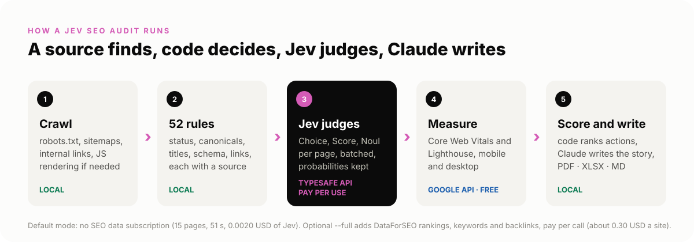
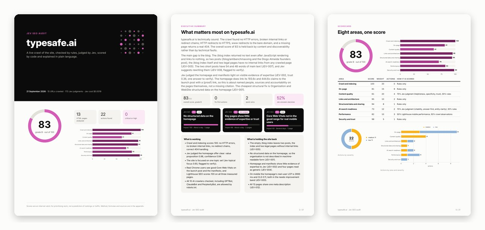
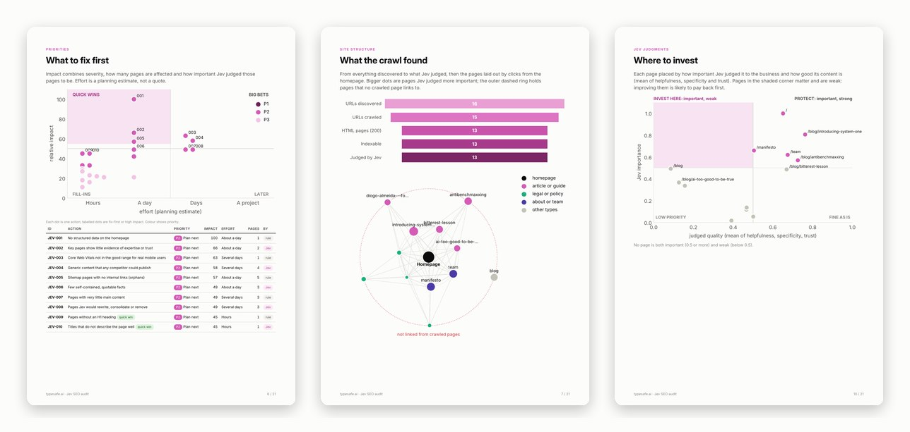
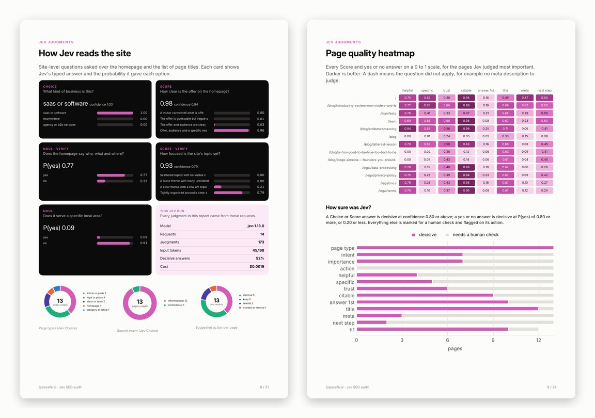
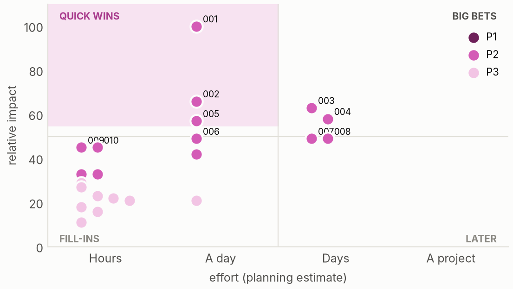
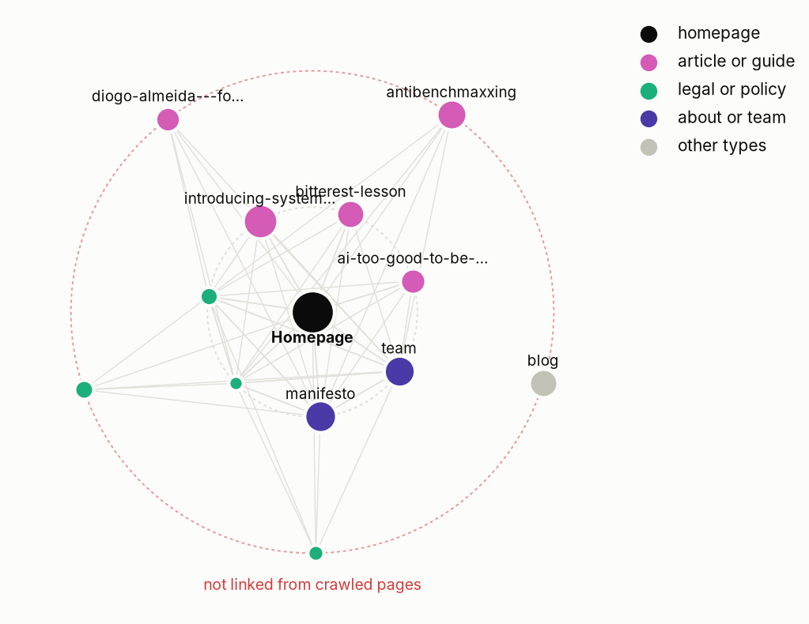
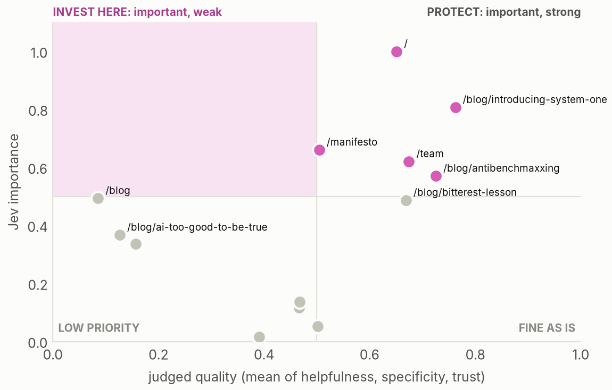

# Jev SEO

**One homepage URL in. A full, live SEO audit out**, judged by
[Jev](https://docs.typesafe.ai/primitives) (TypeSafe's System One model) and
delivered as a designed PDF, an Excel action tracker and a Markdown report.

```
/jev-seo https://example.com
```



## What you get

A PDF of about 20 pages with a score gauge, a written executive summary, the three
actions that matter most, and the method behind every number.



Every fix is ranked by impact and effort, with the site's structure and
the pages worth investing in drawn out.



Jev's typed answers are shown as they came back, with probabilities and a
"verify" flag on anything outside the decisive band.



| Impact versus effort | Site structure | Where to invest |
|---|---|---|
|  |  |  |

Sample: [docs/sample/typesafe.ai-report.pdf](docs/sample/typesafe.ai-report.pdf),
a live audit of the public typesafe.ai site (15 URLs, 44 seconds, 0.0019 USD
of Jev).

Alongside the PDF:

- **report.xlsx**: an Actions sheet you can edit (status, owner, due date
  with dropdowns), a Summary that counts from it live, every page, every raw
  Jev answer with probabilities, technical checks, performance and method.
- **report.md**: the same report in Markdown with chart images and Mermaid
  pies for GitHub and Obsidian.
- **audit.json** and **digest.md**: the single dataset every export is
  built from, and the evidence brief the narrative is written from.

## What runs where, and what it costs

| Part | Where it runs | Cost |
|---|---|---|
| Crawl: robots.txt, sitemaps, links, redirects | Local, plain HTTP requests to the audited site | Free |
| JavaScript rendering for script-only pages | Local headless Chromium (Playwright) | Free |
| 50 rule checks, scoring, ranking | Local Python | Free |
| Charts, PDF, workbook, Markdown | Local (matplotlib, WeasyPrint, openpyxl) | Free |
| Core Web Vitals and Lighthouse | Google PageSpeed Insights API | Free (API key only raises rate limits) |
| Page and site judgments | TypeSafe Jev API | Pay per use: 0.042 USD per million input tokens, output free |
| Rankings, keywords, competitors, backlinks, live SERPs, AI answer mentions (`--full` only) | DataForSEO API | Pay per call, cost reported per call; about 0.30 USD for one site, capped by `--dfs-budget` (default 1.00 USD) |
| Narrative | Claude, in the session running the skill | Part of your Claude plan |

The default mode needs no SEO data subscription: no DataForSEO, Semrush,
Ahrefs or SERP scraping. `--full` adds DataForSEO for the data a crawl cannot
see (rankings, search volumes, backlinks, who else ranks), and Jev filters it:
every keyword is judged for relevance to the business, searches for other
brands are dropped, and each keeper is mapped to the page that should own it.
Measured Jev spend is about 0.00015 USD per page (a 60 page site is roughly
0.01 USD), and `--jev-budget` (default 0.25 USD) is enforced before every
request. Without a TypeSafe key the audit still runs and marks the Jev
sections as not assessed.

## How it thinks

**A source finds, code decides, Jev judges, Claude writes.**

- Anything a count, a status code or a string match can decide is decided
  by code, and every rule cites Google Search Central or a web standard.
- Jev answers narrow typed questions (Choice, Score, Noul), batched per
  page: page type, search intent, importance, helpfulness, specificity,
  trust, citability, title and meta fit, and whether two pages compete.
  Code never asks what it can see itself.
- Missing data stays missing. Heuristics are labelled as heuristics.
  Scores rank work; they never predict rankings or traffic.
- The written summary is checked: unknown action IDs are refused, and any
  number that matches nothing in the audit is flagged before delivery.

## Use

In Claude Code: `/jev-seo https://example.com`. The skill runs the audit in
the background with live progress, reads the digest, spot-checks the top
findings, writes the narrative and renders the reports.

From a terminal:

```bash
bin/jevseo doctor                          # dependencies and keys (never prints values)
bin/jevseo audit https://example.com       # -> jev-seo-reports/<domain>-<stamp>/audit.json + digest.md
bin/jevseo render jev-seo-reports/<dir>    # -> report.pdf, report.xlsx, report.md
bin/jevseo rescore jev-seo-reports/<dir>   # rebuild findings and scores offline, no spend
bin/jevseo run https://example.com         # audit and render with an automatic summary
bin/jevseo audit https://example.com --full                      # add DataForSEO (paid per call)
bin/jevseo audit https://example.com --full --reuse-dfs <dir>    # reuse DataForSEO data already collected
```

Progress streams live in seven stages:

```
[jevseo 00:00] == 1/7 Crawl: robots.txt, sitemaps, then pages
[jevseo 00:07] == 3/7 DataForSEO: location 2840, language en, budget $1.00
[jevseo 00:20] DataForSEO: 17 requests, $0.2995, 0 failed, 0 skipped by budget
[jevseo 00:20] == 4/7 Jev judgments: 43 pages, budget $0.25
[jevseo 00:30] Jev: judging relevance and best page for 80 keywords
[jevseo 00:33] == 5/7 PageSpeed: 3 pages x mobile and desktop, about 30 to 60 seconds
[jevseo 01:02] == 6/7 Scoring
```

Keys come from the environment or `~/Desktop/Keys/.env`:
`TYPESAFE_API_KEY` for Jev, optionally `PAGESPEED_API_KEY`, and for `--full`
`DATAFORSEO_USERNAME` and `DATAFORSEO_PASSWORD`.

## Requirements

Python 3.10+ with requests, beautifulsoup4, lxml, matplotlib, jinja2,
weasyprint and openpyxl. Playwright with Chromium is optional and only used
for pages whose raw HTML is a JavaScript shell. Inter is used when
installed.

## Layout

```
SKILL.md                 skill entrypoint (workflow, options, rules)
bin/jevseo               wrapper that runs the package from any directory
jevseo/                  crawl, parse, checks, jev, psi, score, cli
jevseo/report/           view model, charts, pdf, xlsx, md
jevseo/templates/        report HTML and CSS
references/              narrative contract, Jev judgment registry, method
docs/                    README visuals and the sample report
tests/                   offline tests (no network, no spend)
```

```bash
python3 -m unittest discover -s tests -v
```

## Limits

No Search Console or analytics data, so nothing here measures actual visits
or revenue; in `--full` mode, rankings, volumes and traffic are DataForSEO
estimates. Jev judgments are uncalibrated
for this task family until a labelled set exists; answers outside the
decisive band are flagged "to verify". Large sites are sampled at the page
cap. See [references/method.md](references/method.md).
