# Jev SEO audit: claude-seo.md

Audited 2026-09-22T00:00:35+00:00 · 60 URLs crawled · 60 HTML pages · 825 Jev judgments · Jev cost $0.0198

**Overall score: 93/100 (grade A)**

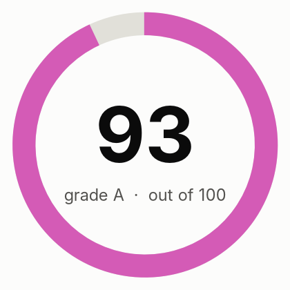

| Area | Score | Weight | How it is scored |
|---|---:|---:|---|
| Crawl and indexing | 99 | 20 | Rules only |
| On-page | 99 | 15 | Rules plus Jev findings |
| Content quality | 89 | 20 | 70% Jev judgment (helpfulness, specificity, trust), 30% rules |
| Links and architecture | 98 | 10 | Rules only |
| Structured data and sharing | 99 | 8 | Rules only |
| AI search readiness | 80 | 12 | 70% Jev judgment (citability, answer-first, entity clarity), 30% rules; editorial heuristics, since Google states no special optimization is required for AI features |
| Performance | 98 | 10 | 50% Lighthouse mobile performance, 50% crawl observations |
| Security and trust | 100 | 5 | Rules only |
| Search visibility and authority | 82 | 15 | DataForSEO rankings, keywords and backlinks, filtered by Jev relevance |

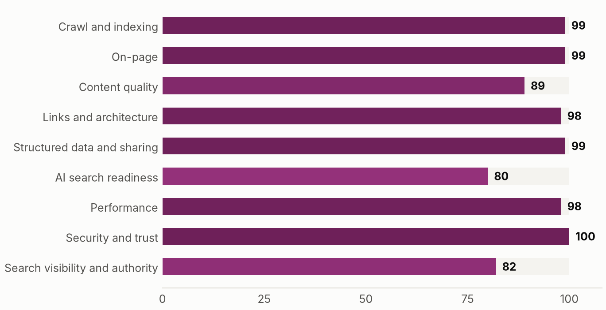

**Contents:** [Executive summary](#executive-summary) · [How this audit was made](#how-this-audit-was-made) · [Priority actions](#priority-actions) · [Search visibility (DataForSEO)](#search-visibility-dataforseo) · [What the crawl found](#what-the-crawl-found) · [How Jev reads the site](#how-jev-reads-the-site) · [Findings by area](#findings-by-area) · [Robots access](#robots-access) · [Page inventory](#page-inventory) · [Method and limits](#method-and-limits)

## Executive summary

claude-seo.md scores 93 out of 100. The technical areas score 98 to 100: no HTTP errors or broken internal links among the 60 crawled pages, a missing URL returns a real 404, and real Chrome users see good Core Web Vitals on mobile and desktop. The crawl stopped at its 60 page cap, so page counts describe a sample.

DataForSEO estimates 61 ranking keywords and about 553 monthly visits, with position 2 for 'claude seo' and position 3 for 'ai seo audit'. The site has 40 referring domains; the large platforms ranking for the same keywords, such as semrush.com and ahrefs.com, have over 100,000 each (JEV-003), so a direct comparison says little about what is achievable.

The most practical work is on keywords: 4 relevant keywords rank at positions 6 to 19 (JEV-001), and 25 relevant searches, mostly low-volume 'claude seo' terms, have an existing page that could target them (JEV-002). Rule-verified fixes are small: SoftwareApplication markup without the rating Google requires for rich results (JEV-005), a temporary 307 www redirect (JEV-006) and a broken Skool profile link (JEV-011).

**What is working**

- Crawl and indexing scores 99 and security 100; Lighthouse SEO is 100 on all three measured pages.
- Jev judged the homepage offer clear: value proposition 1.00, confidence 1.00.
- Position 2 for 'claude seo', position 3 for 'ai seo audit' and 'claude code for seo'.
- Mobile homepage Lighthouse performance 99, with LCP, INP and CLS rated good for real users.
- All 10 AI crawlers checked are allowed by robots.txt.

**What is holding the site back**

- 4 relevant keywords sit at positions 6 to 19, including 'sxo', 'seo code' and 'seo skills claude' (JEV-001).
- 40 referring domains; the sites ranking alongside it are far larger (JEV-003).
- SoftwareApplication markup on 28 pages lacks the aggregateRating or review Google requires for software rich results (JEV-005); add ratings only if real ones exist.
- www.claude-seo.md redirects with a temporary 307 (JEV-006), and the Skool profile link /@daniel-agrici-3925 returns 404 (JEV-011).
- Jev reads the homepage H1 'YOUR SEO TEAM IN THE TERMINAL.' as not naming the topic (JEV-007), although it rates the offer as clear; treat this as a wording suggestion.

### Plan

**This week**

- JEV-011 Fix the Skool profile link (hours)
- JEV-006 Make the www redirect permanent (hours)
- JEV-009 Replace 'LEARN MORE' links with descriptive anchor text (hours)
- JEV-010 Add width and height to the 20 images on the 4 listed blog posts (hours)

**This month**

- JEV-001 Improve the pages ranking at positions 6 to 19 for their keywords (about a day)
- JEV-002 Cover the 'claude seo plugin', 'claude seo audit' and 'claude seo skill github' searches on the pages Jev mapped them to (about a day)
- JEV-005 Add real ratings to SoftwareApplication markup, or accept that software rich results will not show (hours)

**This quarter**

- JEV-003 Earn links from Claude Code and MCP directories, roundups and original data (a project)

Keyword volumes, difficulty and traffic are DataForSEO estimates from a collection at 2026-09-21T23:24:36+00:00; connect Search Console for measured clicks. Items about AI Overviews and answer-first writing (JEV-004, JEV-008) are editorial heuristics: Google states no special optimization is required for its AI features.

_Written by: Claude, from the audit evidence._

## How this audit was made

A source finds, code decides, Jev judges, Claude writes. Code crawls, counts and scores. Jev (TypeSafe's System One model) answers narrow typed questions about meaning, with probabilities. Missing data is shown as missing.

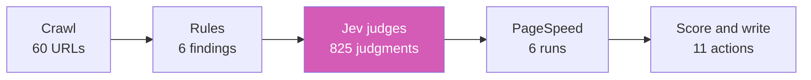

## Priority actions

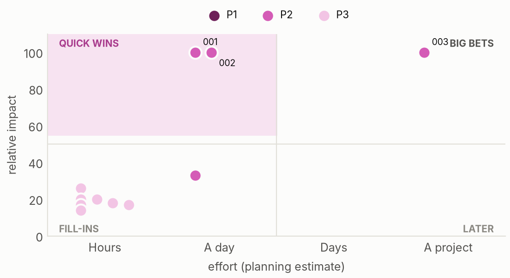

| ID | Action | Priority | Impact | Effort | Pages | By | Verify |
|---|---|---|---:|---|---:|---|---:|
| JEV-001 | Relevant keywords close to page one | P2 Plan next | 100 | About a day | 4 | DataForSEO |  |
| JEV-002 | Relevant keywords an existing page could win | P2 Plan next | 100 | About a day | 25 | DataForSEO | 14 |
| JEV-003 | Far fewer referring domains than sites ranking for the same keywords | P2 Plan next | 100 | A project | 1 | DataForSEO |  |
| JEV-004 | AI Overviews that do not cite the site | P2 Plan next | 33 | About a day | 2 | DataForSEO |  |
| JEV-005 | Structured data missing properties Google requires for rich results | P3 When convenient | 26 | Hours | 28 | rule |  |
| JEV-006 | Host or HTTPS redirect is temporary (302 or 307) | P3 When convenient | 20 | Hours | 1 | rule |  |
| JEV-007 | Main headings that do not state the topic | P3 When convenient | 20 | Hours | 2 | Jev judged | 1 |
| JEV-008 | Pages that bury the main point | P3 When convenient | 18 | Hours | 4 | Jev judged | 4 |
| JEV-009 | Internal links with generic anchor text | P3 When convenient | 17 | Hours | 2 | rule |  |
| JEV-010 | Images without width and height | P3 When convenient | 17 | Hours | 4 | rule |  |
| JEV-011 | External links returning errors | P3 When convenient | 14 | Hours | 1 | rule |  |

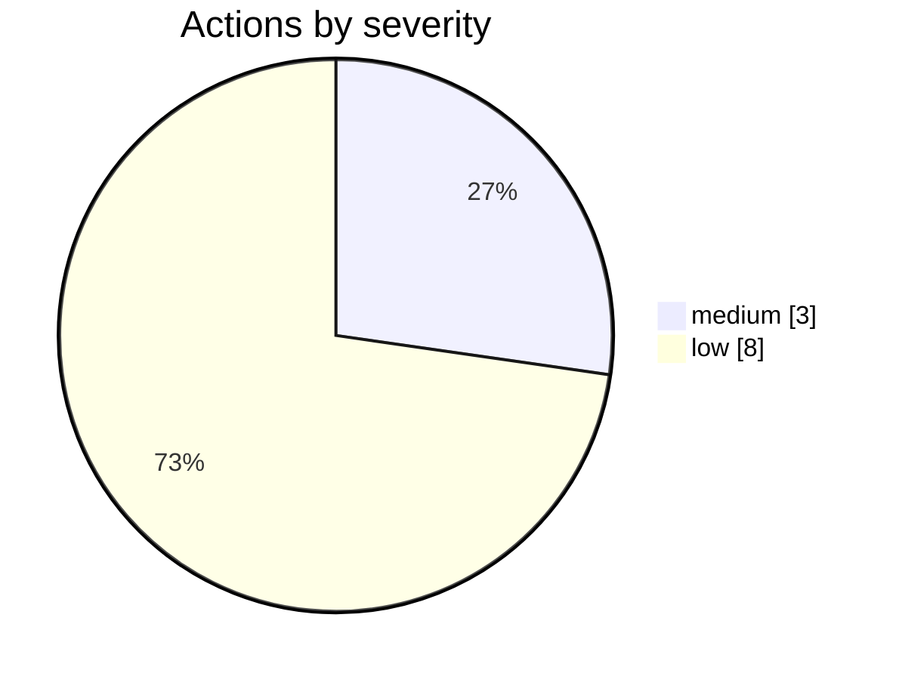

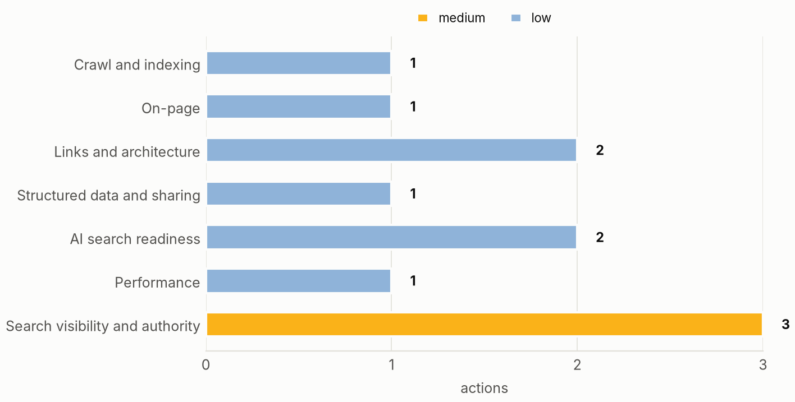

## Search visibility (DataForSEO)

Location 2840, language en. Traffic (ETV) is DataForSEO's estimate, not measured visits.

| Ranking keywords | Est. monthly visits | Referring domains | Backlinks | AI answer mentions |
|---:|---:|---:|---:|---:|
| 61 | 553 | 40 | 276 | 26 |

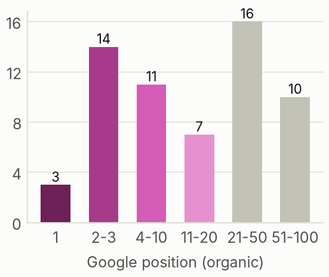

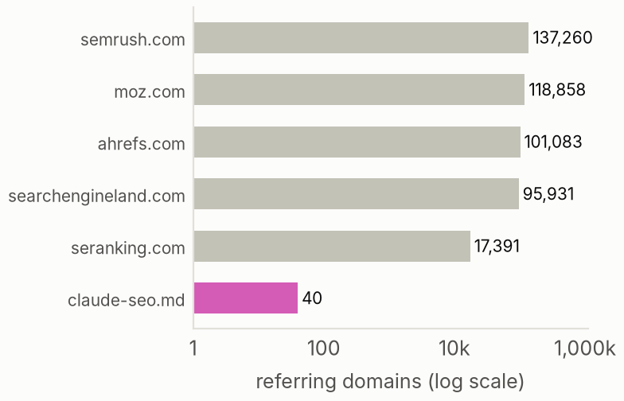

| Keyword | Position | Searches/mo | Ranking page | Jev relevance |
|---|---:|---:|---|---:|
| seo tools | 35 | 110000 | / | 0.92 |
| dataforseo | 11 | 4400 | /skills/seo-dataforseo | 0.76 |
| data for seo | 10 | 880 | /skills/seo-dataforseo | 0.69 |
| wordpress mcp | 22 | 880 | /blog/wp-mcp-ultimate-wordpress-ai-seo | 0.47 |
| sxo | 18 | 720 | /skills/seo-sxo | 0.77 |
| claude seo skill | 25 | 480 | / | 0.99 |
| claude seo | 2 | 390 | / | 0.99 |
| claude seo skills | 26 | 390 | / | 1.00 |
| seo skill | 31 | 320 | / | 0.98 |
| schema code | 81 | 260 | /skills/seo-schema | 0.86 |
| seo machine learning | 59 | 260 | / | 0.62 |
| seo michael | 15 | 260 | / | 0.09 |
| dataforseo mcp | 54 | 210 | /skills/seo-dataforseo | 0.88 |
| hreflang canonical | 89 | 170 | /blog/hreflang-x-default-guide | 0.62 |
| wordpress mcp plugin | 57 | 140 | /blog/wp-mcp-ultimate-wordpress-ai-seo | 0.53 |
| ai seo audit | 3 | 110 | / | 1.00 |
| cloud seo | 1 | 110 | / | 0.61 |
| free website audit online | 19 | 110 | / | 0.86 |
| masterseo | 50 | 110 | / | 0.41 |
| claude code for seo | 3 | 90 | / | 0.98 |

### Keywords worth winning

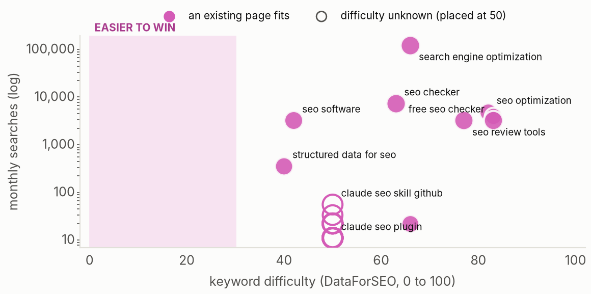

| Keyword | Searches/mo | Difficulty | Intent | Jev relevance | Page to own it |
|---|---:|---:|---|---:|---|
| claude seo skill github | 50 | n/a | navigational | 0.97 | /skills |
| claude seo plugin | 30 | n/a | navigational | 0.96 | / |
| claude seo tool | 20 | n/a | commercial | 1.00 | / |
| claude seo audit | 20 | n/a | informational | 1.00 | /skills/seo-audit |
| claude seo audit skill | 20 | n/a | informational | 1.00 | /skills/seo-audit |
| claude ai seo | 20 | n/a | informational | 0.90 | / |
| seo geo claude skill | 10 | n/a | informational | 0.97 | /skills/seo-geo |
| how to turn claude code into your seo command center | 10 | n/a | transactional | 0.99 | / |
| claude ai seo skill | 10 | n/a | transactional | 0.99 | /skills |
| claude seo reddit | 10 | n/a | navigational | 0.88 | / |
| ai seo audit free | 10 | n/a | informational | 0.99 | / |
| ai seo audit tool | 10 | n/a | commercial | 1.00 | / |
| bulk ai seo audit | 10 | n/a | transactional | 0.92 | /skills/seo-audit |
| agentic seo ai audit | 10 | n/a | commercial | 0.98 | / |
| ai powered seo audit | 10 | n/a | commercial | 0.98 | / |

| Keyword | Site position | AI Overview | Top 3 |
|---|---:|---|---|
| seo tools | not in top 10 | yes, site not cited | smallseotools.com, zapier.com, moz.com |
| dataforseo | not in top 10 | none | dataforseo.com, reddit.com, github.com |
| data for seo | not in top 10 | yes, site not cited | dataforseo.com, reddit.com, github.com |
| wordpress mcp | not in top 10 | yes, site not cited | github.com, developer.wordpress.org, reddit.com |
| sxo | not in top 10 | yes, site not cited | sxowebsite.com, adsmurai.com, coveo.com |

## What the crawl found

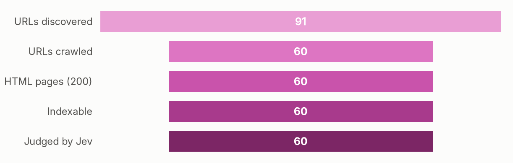

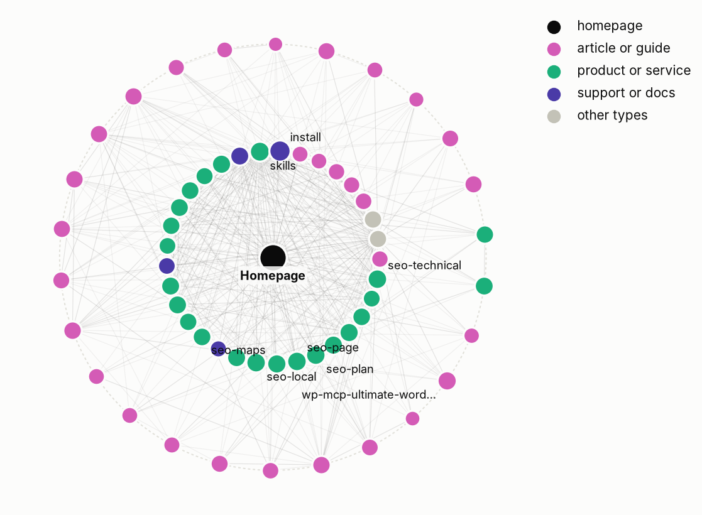

## How Jev reads the site

- **What kind of business is this?** personal or portfolio, confidence 0.49 _(verify)_
- **How clear is the offer on the homepage?** 1.00, confidence 1.00
- **Does the homepage say who, what and where?** P(yes) 0.55 _(verify)_
- **How focused is the site's topic set?** 0.93, confidence 0.79
- **Does it serve a specific local area?** P(yes) 0.05

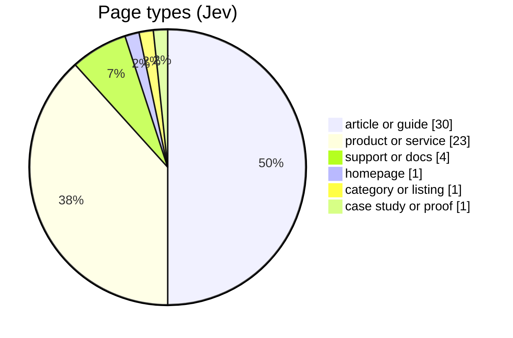

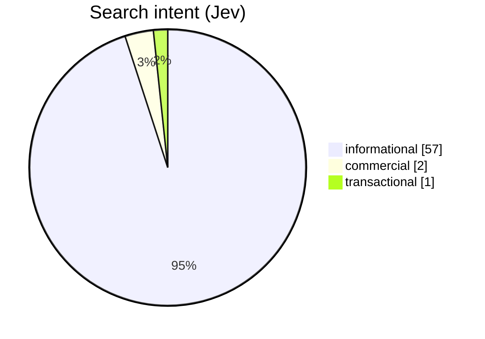

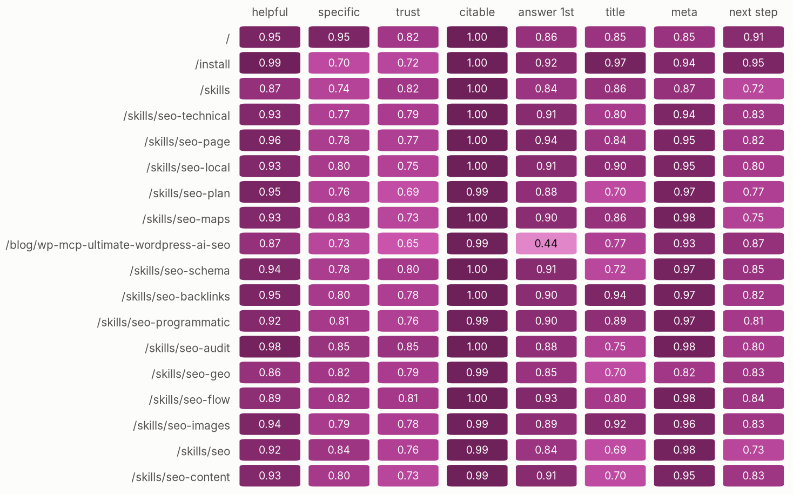

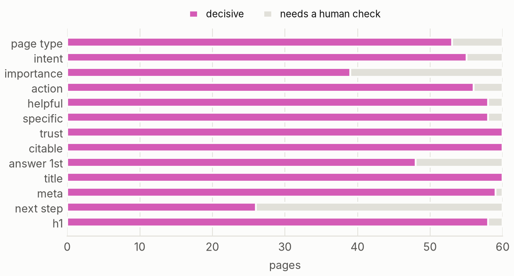

### Where to invest

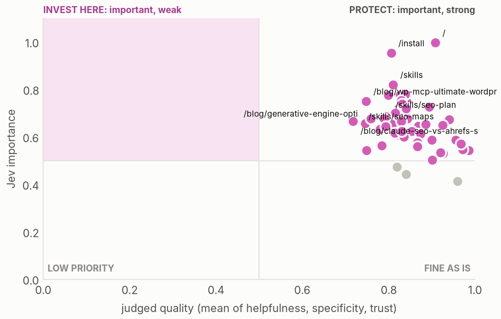

**Pages that may compete for the same searches**

| Page A | Page B | Title overlap | P(compete) |
|---|---|---:|---:|
| https://claude-seo.md/skills/seo-drift | https://claude-seo.md/blog/seo-drift-monitoring-guide | 1.0 | 0.53 |
| https://claude-seo.md/blog/claude-seo-v190-community-release | https://claude-seo.md/blog/claude-seo-v2-release | 1.0 | 0.32 |
| https://claude-seo.md/blog/claude-seo-v190-community-release | https://claude-seo.md/blog/claude-seo-v231-release | 1.0 | 0.31 |
| https://claude-seo.md/blog/claude-seo-v231-release | https://claude-seo.md/blog/claude-seo-v220-release | 1.0 | 0.26 |
| https://claude-seo.md/ | https://claude-seo.md/skills | 1.0 | 0.24 |
| https://claude-seo.md/blog/claude-seo-v190-community-release | https://claude-seo.md/blog/claude-seo-v220-release | 1.0 | 0.24 |
| https://claude-seo.md/skills | https://claude-seo.md/blog/claude-seo-v2-release | 1.0 | 0.23 |
| https://claude-seo.md/blog/claude-seo-v190-community-release | https://claude-seo.md/blog/claude-seo-v181-image-seo | 1.0 | 0.23 |
| https://claude-seo.md/blog/claude-seo-v190-community-release | https://claude-seo.md/blog/claude-seo-v196-flow-security-hardening | 1.0 | 0.23 |
| https://claude-seo.md/blog/claude-seo-v190-community-release | https://claude-seo.md/blog/claude-seo-v224-release | 1.0 | 0.23 |
| https://claude-seo.md/blog/claude-seo-v190-community-release | https://claude-seo.md/blog/claude-seo-v223-release | 1.0 | 0.22 |
| https://claude-seo.md/ | https://claude-seo.md/blog/claude-seo-v2-release | 1.0 | 0.21 |
| https://claude-seo.md/blog/claude-seo-v190-community-release | https://claude-seo.md/blog/claude-seo-v225-release | 1.0 | 0.21 |
| https://claude-seo.md/blog/claude-seo-v190-community-release | https://claude-seo.md/blog/claude-seo-v172-update | 1.0 | 0.21 |
| https://claude-seo.md/blog/claude-seo-v181-image-seo | https://claude-seo.md/blog/claude-seo-v2-release | 1.0 | 0.20 |
| https://claude-seo.md/skills | https://claude-seo.md/blog/claude-seo-v190-community-release | 1.0 | 0.19 |
| https://claude-seo.md/skills | https://claude-seo.md/blog/claude-seo-v231-release | 1.0 | 0.18 |
| https://claude-seo.md/skills | https://claude-seo.md/blog/claude-seo-v220-release | 1.0 | 0.17 |
| https://claude-seo.md/skills | https://claude-seo.md/blog/claude-seo-v223-release | 1.0 | 0.17 |
| https://claude-seo.md/skills | https://claude-seo.md/blog/claude-seo-v181-image-seo | 1.0 | 0.16 |

## Findings by area

### Crawl and indexing (99)

**JEV-006 · Host or HTTPS redirect is temporary (302 or 307)** `P3` `low` `rule`

- Evidence: 1 affected · www.claude-seo.md answered 307
- Fix: Use a permanent redirect (301 or 308) for www, non-www and HTTP to HTTPS, so search engines consolidate on one host. ([source](https://developers.google.com/search/docs/crawling-indexing/301-redirects))
- URLs: https://claude-seo.md/

### On-page (99)

**JEV-007 · Main headings that do not state the topic** `P3` `low` `Jev judged` `1 to verify` `heuristic`

- Evidence: 2 affected · Jev P(H1 states the topic) averaged 0.29 (0 worst, 1 best) on 2 pages: /, /blog/claude-seo-v224-release
- Fix: Make the H1 name the page's topic rather than a slogan. ([source](https://developers.google.com/search/docs/fundamentals/seo-starter-guide))
- URLs: https://claude-seo.md/, https://claude-seo.md/blog/claude-seo-v224-release

### Links and architecture (98)

**JEV-009 · Internal links with generic anchor text** `P3` `low` `rule`

- Evidence: 2 affected · Anchors such as: LEARN MORE →
- Fix: Use anchor text that describes the destination. ([source](https://developers.google.com/search/docs/crawling-indexing/links-crawlable))
- URLs: https://claude-seo.md/blog/best-claude-code-skills, https://claude-seo.md/blog/claude-seo-vs-ahrefs-semrush

**JEV-011 · External links returning errors** `P3` `low` `rule`

- Evidence: 1 affected · 1 of 80 sampled outbound links
- Fix: Update or remove outbound links that no longer resolve. ([source](https://developers.google.com/crawling/docs/troubleshooting/http-status-codes))
- URLs: https://www.skool.com/@daniel-agrici-3925

### Structured data and sharing (99)

**JEV-005 · Structured data missing properties Google requires for rich results** `P3` `low` `rule`

- Evidence: 28 affected · SoftwareApplication on / lacks aggregateRating or review; SoftwareApplication on /skills lacks offers.price, aggregateRating or review; SoftwareApplication on /install lacks aggregateRating or review; SoftwareApplication on /skills/seo-audit lacks offers.price, aggregateRating or review; SoftwareApplication on /skills/seo-technical lacks aggregateRating or review; SoftwareApplication on /skills/seo-technical lacks offers.price, aggregateRating or review; and 45 more
- Fix: Add the missing required properties listed in the evidence, or remove markup that cannot be completed truthfully. ([source](https://developers.google.com/search/docs/appearance/structured-data/intro-structured-data))
- URLs: https://claude-seo.md/, https://claude-seo.md/install, https://claude-seo.md/skills, https://claude-seo.md/skills/seo, https://claude-seo.md/skills/seo-audit, https://claude-seo.md/skills/seo-backlinks, https://claude-seo.md/skills/seo-cluster, https://claude-seo.md/skills/seo-competitor-pages and 20 more

### AI search readiness (80)

**JEV-004 · AI Overviews that do not cite the site** `P2` `low` `DataForSEO` `heuristic`

- Evidence: 2 affected · seo tools (site at position 35; AI Overview cites semrush.com, zapier.com); sxo (site at position 18; AI Overview cites bluerank.com, gemeosagency.com, linkedin.com)
- Fix: Study who is cited today and make sure the page answers the search directly. Google states there are no extra requirements to appear in AI Overviews beyond normal Search eligibility. ([source](https://developers.google.com/search/docs/appearance/ai-features))
- URLs: https://claude-seo.md/

**JEV-008 · Pages that bury the main point** `P3` `low` `Jev judged` `4 to verify` `heuristic`

- Evidence: 4 affected · Jev P(opens with the point) averaged 0.42 (0 worst, 1 best) on 4 pages
- Fix: Open with a one or two sentence answer or offer before any preamble. Editorial heuristic for readers and answer engines, not a Google requirement. ([source](https://developers.google.com/search/docs/appearance/ai-features))
- URLs: https://claude-seo.md/blog/claude-seo-34k-organic-clicks, https://claude-seo.md/blog/generative-engine-optimization-guide, https://claude-seo.md/blog/best-claude-code-skills, https://claude-seo.md/blog/wp-mcp-ultimate-wordpress-ai-seo

### Performance (98)

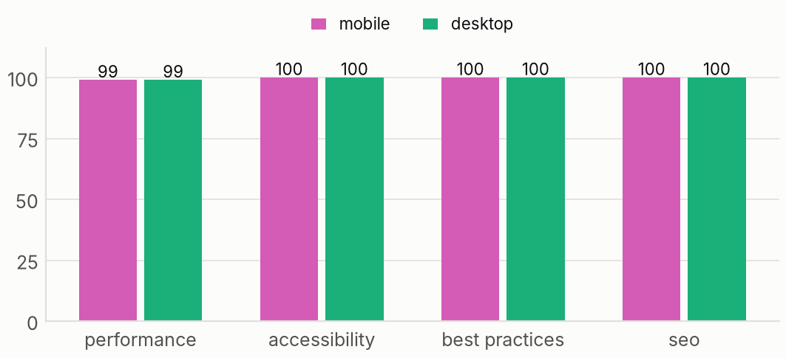

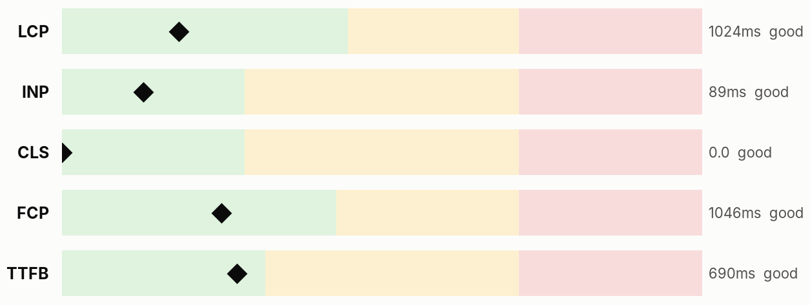

**JEV-010 · Images without width and height** `P3` `low` `rule`

- Evidence: 4 affected · 20 images without explicit size
- Fix: Set width and height so layout does not shift while images load. ([source](https://web.dev/articles/optimize-cls))
- URLs: https://claude-seo.md/blog/claude-seo-v220-release, https://claude-seo.md/blog/claude-seo-v190-community-release, https://claude-seo.md/blog/claude-seo-v2-release, https://claude-seo.md/blog/claude-seo-v196-flow-security-hardening

### Search visibility and authority (82)

**JEV-001 · Relevant keywords close to page one** `P2` `medium` `DataForSEO`

- Evidence: 4 affected · sxo (720/mo, position 18, difficulty 0); seo skills claude (90/mo, position 16, difficulty 0); seo code (90/mo, position 6, difficulty 14); longer term: free website audit online (110/mo, position 19, difficulty 84)
- Fix: Strengthen the ranking page for each keyword: answer the search more fully, add internal links to it and tighten its title. ([source](https://docs.dataforseo.com/v3/dataforseo_labs/overview/))
- URLs: https://claude-seo.md/, https://claude-seo.md/skills, https://claude-seo.md/skills/seo-sxo

**JEV-002 · Relevant keywords an existing page could win** `P2` `medium` `DataForSEO` `14 to verify`

- Evidence: 25 affected · difficulty unknown: claude seo skill github (50/mo) -> /skills; difficulty unknown: claude seo plugin (30/mo) -> /; difficulty unknown: claude seo tool (20/mo) -> /; difficulty unknown: claude seo audit (20/mo) -> /skills/seo-audit; difficulty unknown: claude seo audit skill (20/mo) -> /skills/seo-audit; difficulty unknown: claude ai seo (20/mo) -> /
- Fix: Expand the named page to cover each keyword's search need, then link to it from related pages. ([source](https://docs.dataforseo.com/v3/dataforseo_labs/overview/))
- URLs: https://claude-seo.md/, https://claude-seo.md/skills, https://claude-seo.md/skills/seo-audit, https://claude-seo.md/skills/seo-geo, https://claude-seo.md/skills/seo-maps, https://claude-seo.md/skills/seo-schema and 17 more

**JEV-003 · Far fewer referring domains than sites ranking for the same keywords** `P2` `medium` `DataForSEO` `heuristic`

- Evidence: 1 affected · 40 referring domains against a median of 101,083 across 5 domains ranking for the same keywords (semrush.com 137,260, moz.com 118,858, ahrefs.com 101,083, searchengineland.com 95,931, seranking.com 17,391)
- Fix: Earn links from sites your audience already reads: original data, tools, guest expertise and partner pages. ([source](https://docs.dataforseo.com/v3/backlinks/overview/))
- URLs: https://claude-seo.md/

## Robots access

| User agent | Access |
|---|---|
| Googlebot | allowed |
| Bingbot | allowed |
| GPTBot | allowed |
| OAI-SearchBot | allowed |
| ChatGPT-User | allowed |
| ClaudeBot | allowed |
| Claude-SearchBot | allowed |
| PerplexityBot | allowed |
| Google-Extended | allowed |
| Applebot-Extended | allowed |
| CCBot | allowed |
| Bytespider | allowed |

## Page inventory

| Page | Depth | Words | Inlinks | Type (Jev) | Intent (Jev) | Importance | Action (Jev) |
|---|---:|---:|---:|---|---|---:|---|
| https://claude-seo.md/ | 0 | 1791 | 59 | homepage | informational | 1.00 | keep or improve |
| https://claude-seo.md/blog | 1 | 1290 | 59 | category or listing | informational | 0.65 | keep or improve |
| https://claude-seo.md/blog/claude-seo-34k-organic-clicks | 1 | 1865 | 2 | case study or proof | informational | 0.67 | keep or improve |
| https://claude-seo.md/blog/claude-seo-v180-free-backlinks | 1 | 1552 | 6 | article or guide | informational | 0.61 | keep or improve |
| https://claude-seo.md/blog/claude-seo-v181-image-seo | 1 | 1646 | 5 | article or guide | informational | 0.58 | keep or improve |
| https://claude-seo.md/blog/claude-seo-v190-community-release | 1 | 1748 | 7 | article or guide | informational | 0.59 | keep or improve |
| https://claude-seo.md/blog/claude-seo-v220-release | 1 | 1317 | 3 | article or guide | informational | 0.53 | keep or improve |
| https://claude-seo.md/blog/claude-seo-v231-release | 1 | 1966 | 3 | article or guide | informational | 0.54 | keep or improve |
| https://claude-seo.md/install | 1 | 540 | 10 | support or docs | transactional | 0.95 | keep or improve |
| https://claude-seo.md/skills | 1 | 1060 | 59 | product or service | informational | 0.82 | keep or improve |
| https://claude-seo.md/skills/seo-audit | 1 | 1747 | 33 | support or docs | informational | 0.73 | keep or improve |
| https://claude-seo.md/skills/seo-backlinks | 1 | 1626 | 7 | product or service | informational | 0.75 | keep or improve |
| https://claude-seo.md/skills/seo-cluster | 1 | 1657 | 9 | product or service | informational | 0.65 | keep or improve |
| https://claude-seo.md/skills/seo-competitor-pages | 1 | 1576 | 4 | product or service | informational | 0.70 | keep or improve |
| https://claude-seo.md/skills/seo-content | 1 | 1555 | 13 | product or service | informational | 0.72 | keep or improve |
| https://claude-seo.md/skills/seo-dataforseo | 1 | 1614 | 11 | product or service | informational | 0.67 | keep or improve |
| https://claude-seo.md/skills/seo-drift | 1 | 1606 | 7 | product or service | informational | 0.61 | keep or improve |
| https://claude-seo.md/skills/seo-ecommerce | 1 | 1520 | 5 | support or docs | informational | 0.61 | keep or improve |
| https://claude-seo.md/skills/seo-flow | 1 | 1682 | 12 | product or service | informational | 0.73 | keep or improve |
| https://claude-seo.md/skills/seo-geo | 1 | 1737 | 16 | product or service | informational | 0.73 | keep or improve |
| https://claude-seo.md/skills/seo-google | 1 | 1901 | 4 | product or service | informational | 0.67 | keep or improve |
| https://claude-seo.md/skills/seo-hreflang | 1 | 1795 | 3 | product or service | informational | 0.70 | keep or improve |
| https://claude-seo.md/skills/seo-image-gen | 1 | 2244 | 4 | support or docs | informational | 0.56 | keep or improve |
| https://claude-seo.md/skills/seo-images | 1 | 1572 | 6 | product or service | informational | 0.73 | keep or improve |
| https://claude-seo.md/skills/seo-local | 1 | 1868 | 8 | product or service | informational | 0.78 | keep or improve |
| https://claude-seo.md/skills/seo-maps | 1 | 1573 | 6 | product or service | informational | 0.75 | keep or improve |
| https://claude-seo.md/skills/seo-page | 1 | 1552 | 6 | product or service | informational | 0.78 | keep or improve |
| https://claude-seo.md/skills/seo-plan | 1 | 1455 | 7 | product or service | informational | 0.78 | keep or improve |
| https://claude-seo.md/skills/seo-programmatic | 1 | 1612 | 6 | product or service | informational | 0.74 | keep or improve |
| https://claude-seo.md/skills/seo-schema | 1 | 1534 | 22 | product or service | informational | 0.75 | keep or improve |
| https://claude-seo.md/skills/seo-sitemap | 1 | 1555 | 6 | product or service | informational | 0.70 | keep or improve |
| https://claude-seo.md/skills/seo-sxo | 1 | 1578 | 7 | product or service | informational | 0.62 | keep or improve |
| https://claude-seo.md/skills/seo-technical | 1 | 1698 | 27 | product or service | informational | 0.78 | keep or improve |
| https://claude-seo.md/speed-report | 1 | 1826 | 4 | article or guide | informational | 0.59 | keep or improve |
| https://claude-seo.md/ai-visibility-tool | 2 | 822 | 1 | article or guide | informational | 0.65 | keep or improve |
| https://claude-seo.md/blog/best-claude-code-skills | 2 | 1940 | 2 | article or guide | informational | 0.62 | keep or improve |
| https://claude-seo.md/blog/claude-seo-v172-update | 2 | 1468 | 3 | article or guide | informational | 0.47 | keep or improve |
| https://claude-seo.md/blog/claude-seo-v196-flow-security-hardening | 2 | 2325 | 5 | article or guide | informational | 0.55 | keep or improve |
| https://claude-seo.md/blog/claude-seo-v2-release | 2 | 2011 | 2 | article or guide | informational | 0.65 | keep or improve |
| https://claude-seo.md/blog/claude-seo-v223-release | 2 | 1221 | 2 | article or guide | informational | 0.41 | keep or improve |
| https://claude-seo.md/blog/claude-seo-v224-release | 2 | 1012 | 4 | article or guide | informational | 0.53 | keep or improve |
| https://claude-seo.md/blog/claude-seo-v225-release | 2 | 912 | 3 | article or guide | informational | 0.57 | keep or improve |
| https://claude-seo.md/blog/claude-seo-vs-ahrefs-semrush | 2 | 2021 | 13 | article or guide | commercial | 0.67 | keep or improve |
| https://claude-seo.md/blog/flow-framework-seo-guide | 2 | 1996 | 5 | article or guide | informational | 0.67 | keep or improve |
| https://claude-seo.md/blog/free-seo-audit-tool-guide | 2 | 1889 | 4 | article or guide | commercial | 0.68 | keep or improve |
| https://claude-seo.md/blog/generative-engine-optimization-guide | 2 | 2518 | 10 | article or guide | informational | 0.66 | keep or improve |
| https://claude-seo.md/blog/google-api-seo-reporting-claude | 2 | 1676 | 7 | article or guide | informational | 0.63 | keep or improve |
| https://claude-seo.md/blog/how-to-run-free-seo-audit-claude-seo | 2 | 1349 | 16 | article or guide | informational | 0.69 | keep or improve |
| https://claude-seo.md/blog/hreflang-x-default-guide | 2 | 1646 | 2 | article or guide | informational | 0.54 | keep or improve |
| https://claude-seo.md/blog/local-seo-guide | 2 | 6494 | 2 | article or guide | informational | 0.54 | keep or improve |
| https://claude-seo.md/blog/robots-txt-guide | 2 | 4872 | 1 | article or guide | informational | 0.56 | keep or improve |
| https://claude-seo.md/blog/schema-markup-generator-guide | 2 | 1526 | 4 | article or guide | informational | 0.64 | keep or improve |
| https://claude-seo.md/blog/seo-drift-monitoring-guide | 2 | 1749 | 2 | article or guide | informational | 0.60 | keep or improve |
| https://claude-seo.md/blog/technical-seo-with-claude-code | 2 | 1744 | 15 | article or guide | informational | 0.68 | keep or improve |
| https://claude-seo.md/blog/topic-clustering-serp-overlap | 2 | 1811 | 3 | article or guide | informational | 0.62 | keep or improve |
| https://claude-seo.md/blog/webmcp-website-readiness | 2 | 1892 | 2 | article or guide | informational | 0.44 | keep or improve |
| https://claude-seo.md/blog/wp-mcp-ultimate-wordpress-ai-seo | 2 | 1647 | 1 | article or guide | informational | 0.75 | keep or improve |
| https://claude-seo.md/blog/xml-sitemap-guide | 2 | 6218 | 3 | article or guide | informational | 0.50 | keep or improve |
| https://claude-seo.md/skills/seo | 2 | 1433 | 2 | product or service | informational | 0.72 | keep or improve |
| https://claude-seo.md/skills/seo-content-brief | 2 | 1499 | 5 | product or service | informational | 0.68 | keep or improve |

## Method and limits

- Area score: 100 minus, per finding, severity amount (critical 25, high 12, medium 6, low 2) × (0.5 + 0.5 × share of pages affected). Content and AI readiness blend 70% Jev judgment with 30% rules. Performance blends 50% Lighthouse mobile with 50% crawl observations.
- Overall: weighted mean of scored areas; unscored areas are excluded, never zero.
- Impact: severity weight × (0.6 + 0.4 × reach) × (0.6 + 0.8 × highest Jev importance of affected pages), scaled to 100.
- Jev answers are decisive at confidence 0.80 (Choice, Score) or P(yes) at least 0.80 or at most 0.20 (Noul). Others are flagged to verify.
- Jev: model jev-1.13.0, 78 requests, 470274 input tokens, 0 failed, cost $0.0198.
- DataForSEO: 17 requests, $0.3163; data reused from the collection at 2026-09-21T23:24:36+00:00. Rankings, volumes, difficulty and traffic (ETV) are DataForSEO estimates. No Search Console or analytics data was used.
- Scores rank work; they do not predict rankings or traffic.

_Generated by jev-seo 0.1.0._
